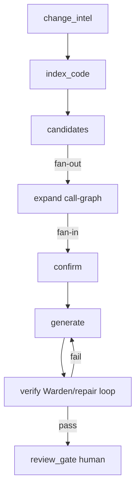

# Mendpoint — Architecture

## Agentic approach: graph engineering first

**Go-to paradigm:** [graph engineering](./GRAPH_ENGINEERING.md) — specialized **nodes** (each a loop with its own verifier), **edges** (explicit routing), **shared state** along edges.  

We do **not** run one overloaded agent that discovers, patches, and self-reviews in a single muddy context.  

- **Loop engineering** = how each node works (Gauge, repair, confirm).  
- **Graph engineering** = how the product is wired (change intel → fan-out expand → confirm → generate → verify → human review).  

Domain **code/API graphs** (call-graph, e-graph, product graph) and the **agent orchestration graph** (`@mendpoint/orchestrator`) are both first-class.

## Why impact analysis is the core

Impact analysis answers: *Given a concrete API change, which exact locations in this customer’s codebase are affected, with what confidence, and with enough context to generate a correct migration PR?*

A pure LLM scan of the entire repository is too expensive, non-deterministic, and incomplete at scale. Pure static analysis is precise on well-typed SDK-heavy code but fails on dynamic HTTP, wrappers, and generated clients. **Mendpoint uses a hybrid multi-stage pipeline expressed as an agent graph.**

## High-level agent graph (product topology)



Canonical definition: `wardenProductGraph()` in `@mendpoint/orchestrator`. See `docs/GRAPH_ENGINEERING.md`.

| Stage | Package | Role |
|-------|---------|------|
| Change normalizer | `@mendpoint/change-intel` | OpenAPI structural diff → **Impactable Surfaces** |
| Codebase index | `@mendpoint/codebase-index` | Pre-compute imports, functions, API usages + embeds **call graph** |
| **Call graph** | `@mendpoint/call-graph` | Hybrid RA/CHA/RTA-lite construction + reverse reachability queries |
| Candidate discovery | `@mendpoint/code-impact` `discoverCandidates` | Fast high-recall filter (SDK / syntactic / string / import) |
| Context expansion | `@mendpoint/code-impact` `expandContexts` | Call-graph reverse reachability (1–3 hops) + wrappers + compact slice |
| Deep confirmation | `@mendpoint/code-impact` `confirmImpacts` | Static first; optional targeted LLM on slices |
| Impact report | `@mendpoint/code-impact` `analyzeImpact` | Contract into generation |
| **E-graph rewrites** | `@mendpoint/egraph` | Equality saturation for migration alternatives (localized fragments) |
| PR generation | `@mendpoint/generation` | Deterministic edits + optional e-graph migration hints |
| **Concrete examples** | `fixtures/examples` + `@mendpoint/examples` | Stripe / OpenAI / AWS / fintech / adoption end-to-end demos |
| **Policy** | `@mendpoint/policy` | No auto-merge; never-touch paths; auth dual-review labels |
| **Metrics** | `GET /metrics` + web `/metrics` | PR funnel, merge rate, TTM |
| **Catalog / detect** | `@mendpoint/catalog` | Lockfile + import → monitored vendors |
| **Learning** | `suppressed_patterns` | Closed PR feedback suppresses re-proposals |
| Delivery | `@mendpoint/github` | Mock or Octokit; **never** direct push to protected branches |
| Orchestration | `@mendpoint/pipeline` | Persist + policy + learning + audit |
| **Agent graph** | `@mendpoint/orchestrator` | Topology, routing, shared state, Mermaid/export |
| **Graph learning** | `@mendpoint/graph-learn` | Durable API/code KG, graph-RAG, PR outcome labels (Dim 6) |


## Change intelligence (input)

**Primary signals (priority order):**
1. OpenAPI schema diff (path/method/field renames, required fields, removals)
2. SDK surface changes (tokens derived from path → e.g. `charges.create`)
3. Structured changelog / migration notes (attached to surfaces)
4. Semantic labels: `breaking` | `non_breaking` | `new_capability`

**Output:** list of `ImpactableSurface` — each with `canonicalId`, before/after, severity, migration strategy, `searchTokens`.

```ts
normalizeChange(oldSpec, newSpec, { providerSlug, providerNotes })
// → { diff: StructuralDiff, surfaces: ImpactableSurface[] }
```

## Codebase indexing (pre-computation)

Runs on connect / demo (and can re-run incrementally via content hashes).

**Extracted:**
- File inventory + language + test flag + content hash
- Imports (source + lockfile package names)
- Function spans + approximate callees / reverse callers
- API usage records: `sdk_call`, `http_path`, `config`, `graphql`
- Package boundaries for monorepos (`packages/*`, `apps/*`)

**Storage:** JSON index under `repo/.mendpoint/codebase-index.json` (MVP). Full source is not retained beyond the analysis window; only index + temporary slices feed confirmation/LLM.

MVP front-end is heuristic/regex **in the spirit of tree-sitter**. Swappable later for tree-sitter, LSP, or CodeQL without changing downstream contracts.

## Candidate discovery (high recall)

Deterministic layers:
1. **SDK graph** — indexed `sdk_call` usages vs surface tokens  
2. **Syntactic** — HTTP path / field word matches  
3. **String heuristics** — config / base URL markers  
4. **Import expansion** — files importing related packages (low weight; filtered at confirm)

## Call graph construction (`@mendpoint/call-graph`)

A **call graph** is a directed graph: nodes = functions/methods, edges = CALLS. It is the primary mechanism for expanding from a *direct* API usage site to wrappers, service layers, and controllers that transitively care about the change.

### Construction pipeline

1. **Parsing & symbol extraction** — function/method defs, call sites, class hierarchy, instantiations (heuristic front-end; tree-sitter-ready).
2. **Symbol table + hierarchy** — name → nodes; `extends`/`implements` / Python bases; observed `new Type`.
3. **Direct resolution** — unique name or same-file match → high-confidence edge.
4. **Indirect / virtual** — RTA-lite (instantiated types) / CHA-lite; dynamic languages fall back to name-based RA (soundness-biased: keep all targets at low confidence).
5. **Graph assembly** — edges annotated with `resolution` (`direct` \| `name_match` \| `cha` \| `rta` \| …), `confidence`, `virtual` flag.

### Design choices

| Preference | Why |
|------------|-----|
| **Soundness over precision** | Missing a usage is worse than a false positive the LLM stage can filter |
| **Application-centered** | Model customer code thoroughly; only imported SDK surfaces as leaves |
| **Depth-limited queries** | Reverse reachability default **k = 1–3** for impact expansion |
| **Incrementality** | **Reset-recompute** (`docs/INCREMENTAL_GRAPH.md`) + **persistent content-addressable versions** (`docs/PERSISTENT_GRAPH.md`) |


### Key queries

- `reverseReachability(seed, { maxDepth })` — transitive callers  
- `findWrappers(seeds)` — thin service-layer abstractions  
- `impactSubgraph(seeds)` — seeds + upstream nodes/edges for LLM context windows  
- `propagateConfidence` — path length + edge confidence demotion  

### Integration with impact stages

1. Candidate discovery finds **direct** API usages.  
2. Expansion seeds the call graph at the enclosing function and walks **upstream**.  
3. `ExpandedContext.graphCallers` / `wrappers` feed confirmation and PR evidence.  
4. Confidence can be demoted for deep / approximate paths.

See package `packages/call-graph` and tests for a PaymentService → chargeCustomer fixture.

## Context expansion

Per candidate:
- Enclosing function body (capped slice)
- **Call-graph reverse reachability** (default 3 hops) → `graphCallers` with depth + edge confidence
- Wrapper detection (`findWrappers`)
- Package boundary + test-file flag
- Legacy name-only fallback if graph has no seed

Produces a compact `ExpandedContext.slice` — never whole-repo dumps.


## Deep confirmation

1. **Static** — require non-import-only evidence; classify `impactType` (`direct_call`, `field_access`, `http_path`, `configuration`, `test_only`, …); set confidence.  
2. **LLM (optional)** — only when `OPENAI_API_KEY` / `XAI_API_KEY` set; receives change surfaces + slice + strict schema. Never whole-repo.

**Routing:**
- **high** → auto PR generation  
- **medium** → PR with extra review flags  
- **low** → notification only (`lowConfidenceNotifications`)

## Impact report → generation

```ts
ImpactReport {
  surfaces, sites[], overallRisk, overallConfidence,
  strategySummary, candidateCount, confirmedCount,
  lowConfidenceNotifications[]
}
```

Each confirmed site carries file, range, confidence, evidence, impact type, fix hint, confirmation path. Generation consumes this brief for patches + PR body.

## Package dependency direction

```
shared
  ↑
db · change-intel · call-graph
  ↑
codebase-index
  ↑
code-impact · generation · github
  ↑
pipeline
  ↑
api · worker · scripts
```


## Trust boundary

- PR-only delivery; mock GitHub by default  
- Only candidate slices may leave the trust boundary for LLM  
- Full audit trail of normalize / analyze / open-PR events  
- Model-bound repository context is redacted before transmission  
- The current design-partner preview runs on a provider tier (Meta Muse Spark contributor) where prompts and completions may be used for provider model training; this is an explicit operator opt-in and is disclosed to design partners  

## Storage

SQLite via Node `node:sqlite` for control-plane metadata. Codebase index is per-repo JSON (graph + relational metadata; vector embeddings are a later plug-in).

## Hard cases (roadmap mapping)

| Scenario | Current | Next |
|----------|---------|------|
| Official SDK | SDK usage index + tokens | API-graph / CodeQL-style |
| Raw fetch/HTTP | Path syntactic + static confirm | Stronger data-flow |
| Generated clients | Heuristics | Detect generators; regenerate layer |
| Dynamic calls | Low confidence / LLM hook | Embeddings + hybrid |
| Thin wrappers | Call-graph expansion | Multi-hop data-flow |
| Multi-language monorepo | TS/JS + Python indexes | Go/Java/Ruby front-ends |

## Why this wins

- **Precision** where SDK graphs exist  
- **Recall** on messy HTTP/string reality  
- **Scalability** — heavy work at index time; per-change work is focused  
- **Auditable** — every site has evidence in the PR  
- **Evolvable** — stages swap without redesigning the product loop  
- **Graph-native** — impact + API delta + product knowledge graphs are first-class product surfaces (`docs/GRAPH_NATIVE.md`, `/graph`)  

